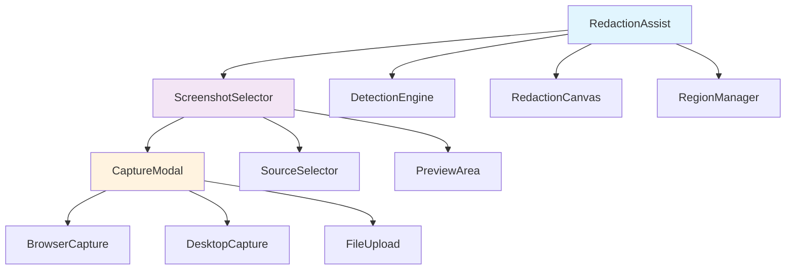
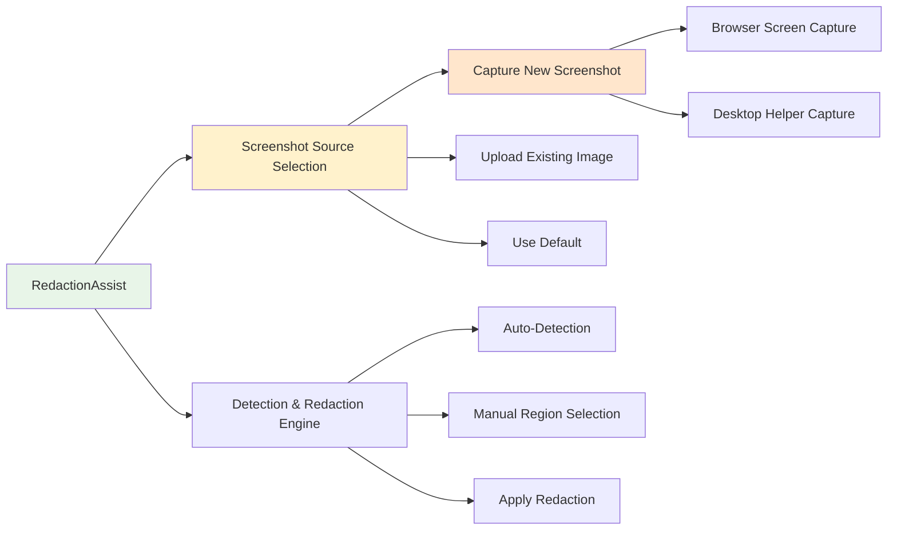
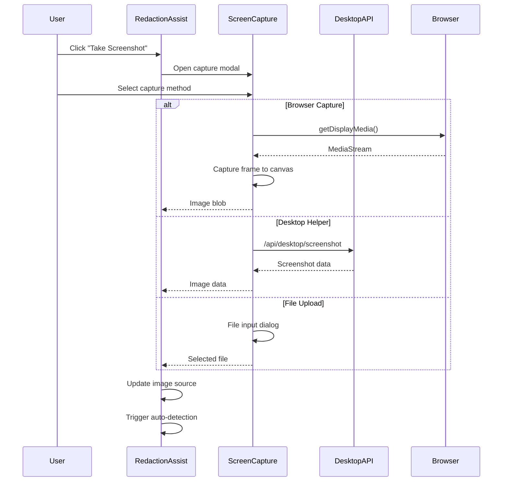
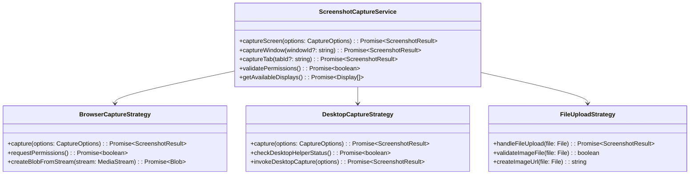
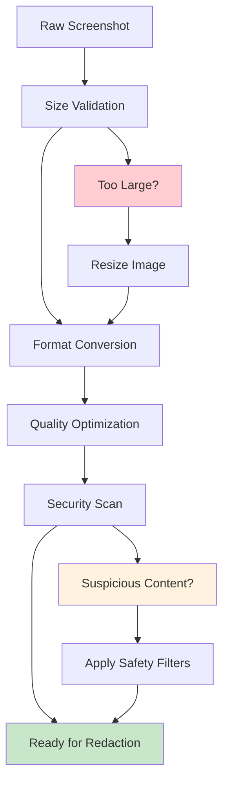
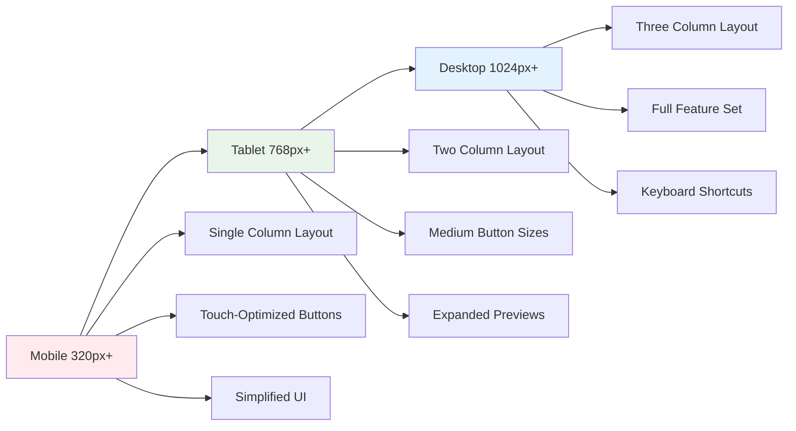

# Screenshot Selection Enhancement for Redaction Assist

## Overview

The Redaction Assist feature currently uses a hardcoded placeholder screenshot (`/api/placeholder-screenshot`) limiting its practical utility. This enhancement adds screenshot capture capabilities to allow users to take and select actual screenshots for redaction, significantly improving the feature's real-world applicability.

## Technology Stack

- **Frontend**: React with TypeScript, Next.js App Router
- **UI Framework**: Radix UI with Tailwind CSS
- **Browser APIs**: MediaDevices Screen Capture API (`getDisplayMedia`)
- **Image Processing**: Canvas API for image manipulation
- **State Management**: React Hooks and Zustand
- **Desktop Integration**: Optional Tauri-based Desktop Helper for enhanced capabilities

## Component Architecture

### Enhanced Redaction Assist Component



### Component Hierarchy



## Routing & Navigation

The enhancement integrates seamlessly with existing navigation:

- **Phase2 Integration**: Access via "Redaction Assist" tab in Phase2Hub
- **Assist Dock**: Quick access through sidebar assist dock
- **Suggested Actions**: Direct access from chat suggestions
- **App Sidebar**: Shortcut in main navigation sidebar

## State Management

### Component State Structure

```typescript
interface RedactionAssistState {
  // Screenshot management
  currentImageUrl: string | null;
  imageSource: 'capture' | 'upload' | 'default';
  captureModalOpen: boolean;
  
  // Detection and redaction
  detectedRegions: SensitiveRegion[];
  isDetecting: boolean;
  showRegions: boolean;
  isProcessing: boolean;
  
  // UI state
  selectedCaptureMethod: 'browser' | 'desktop' | 'file';
  previewDimensions: { width: number; height: number };
}
```

### Global State Integration

```typescript
// Zustand store enhancement
interface OhFixItStore {
  redactionAssist: {
    lastCapturedImage: string | null;
    autoDetectEnabled: boolean;
    preferredCaptureMethod: 'browser' | 'desktop';
    recentScreenshots: ScreenshotRecord[];
  };
}
```

## API Integration Layer

### Screenshot Capture APIs



### Desktop API Integration

```typescript
// Enhanced Desktop Helper API
interface DesktopScreenshotAPI {
  captureScreen(options: {
    region?: { x: number; y: number; width: number; height: number };
    display?: number;
    includeCursor: boolean;
    format: 'png' | 'jpeg';
    quality: number;
  }): Promise<{
    data: string; // base64
    format: string;
    size: number;
    dimensions: { width: number; height: number };
    timestamp: string;
  }>;
}
```

## Data Models & Schema

### Screenshot Management Schema

```typescript
interface ScreenshotSource {
  id: string;
  type: 'browser' | 'desktop' | 'upload' | 'default';
  url: string;
  metadata: {
    captureMethod: string;
    timestamp: Date;
    dimensions: { width: number; height: number };
    fileSize?: number;
    filename?: string;
  };
}

interface CaptureOptions {
  source: 'screen' | 'window' | 'tab';
  region?: BoundingBox;
  includeCursor: boolean;
  format: 'png' | 'jpeg';
  quality: number; // 1-100 for JPEG
}

interface BoundingBox {
  x: number;
  y: number;
  width: number;
  height: number;
}
```

### Enhanced Redaction Region Schema

```typescript
interface SensitiveRegion {
  id: string;
  type: 'email' | 'ssn' | 'phone' | 'credit_card' | 'address' | 'name' | 'custom';
  x: number;
  y: number;
  width: number;
  height: number;
  confidence: number;
  originalText?: string;
  source: 'auto' | 'manual'; // Track detection source
  timestamp: Date; // When region was detected/added
}
```

## Business Logic Layer

### Screenshot Capture Service



### Image Source Manager

```typescript
class ImageSourceManager {
  private currentSource: ScreenshotSource | null = null;
  private sourceHistory: ScreenshotSource[] = [];

  async setImageSource(source: ScreenshotSource): Promise<void> {
    // Clean up previous source if needed
    if (this.currentSource?.url.startsWith('blob:')) {
      URL.revokeObjectURL(this.currentSource.url);
    }
    
    this.currentSource = source;
    this.sourceHistory.unshift(source);
    
    // Keep only last 5 sources in history
    this.sourceHistory = this.sourceHistory.slice(0, 5);
  }

  getCurrentImageUrl(): string | null {
    return this.currentSource?.url || null;
  }

  getImageMetadata(): ScreenshotSource['metadata'] | null {
    return this.currentSource?.metadata || null;
  }
}
```

## Middleware & Interceptors

### Permission Validation Middleware

```typescript
class ScreenCapturePermissionMiddleware {
  async validateBrowserPermissions(): Promise<boolean> {
    try {
      // Check if getDisplayMedia is supported
      if (!navigator.mediaDevices?.getDisplayMedia) {
        throw new Error('Screen capture not supported');
      }
      
      // Test permission without actually capturing
      return true;
    } catch (error) {
      return false;
    }
  }

  async validateDesktopPermissions(): Promise<boolean> {
    try {
      const response = await fetch('/api/desktop/status');
      const status = await response.json();
      return status.connected;
    } catch {
      return false;
    }
  }
}
```

### Image Processing Pipeline



## Testing Strategy

### Unit Testing

```typescript
describe('ScreenshotCaptureService', () => {
  test('browser capture with valid permissions', async () => {
    // Mock getDisplayMedia
    const mockStream = new MockMediaStream();
    navigator.mediaDevices.getDisplayMedia = jest.fn().mockResolvedValue(mockStream);
    
    const service = new ScreenshotCaptureService();
    const result = await service.captureScreen({ source: 'screen' });
    
    expect(result.success).toBe(true);
    expect(result.data).toBeDefined();
  });

  test('desktop capture fallback when browser fails', async () => {
    // Mock browser failure
    navigator.mediaDevices.getDisplayMedia = jest.fn().mockRejectedValue(new Error('Permission denied'));
    
    // Mock desktop helper success
    fetch.mockResolvedValueOnce({
      ok: true,
      json: () => Promise.resolve({ success: true, data: 'base64data' })
    });
    
    const service = new ScreenshotCaptureService();
    const result = await service.captureScreen({ source: 'screen' });
    
    expect(result.success).toBe(true);
    expect(result.source).toBe('desktop');
  });
});
```

### Integration Testing

```typescript
describe('Redaction Assist Integration', () => {
  test('full screenshot capture and redaction workflow', async () => {
    render(<RedactionAssist onRedactedImage={mockCallback} />);
    
    // Open screenshot selector
    fireEvent.click(screen.getByText('Take Screenshot'));
    
    // Select browser capture
    fireEvent.click(screen.getByText('Capture Screen'));
    
    // Mock successful capture
    await waitFor(() => {
      expect(screen.getByAltText('Screenshot for redaction')).toBeInTheDocument();
    });
    
    // Trigger auto-detection
    fireEvent.click(screen.getByText('Auto-Detect Sensitive Info'));
    
    // Verify regions detected
    await waitFor(() => {
      expect(screen.getByText('Detected Sensitive Information:')).toBeInTheDocument();
    });
    
    // Apply redaction
    fireEvent.click(screen.getByText('Apply Redaction'));
    
    // Verify callback called with redacted image
    await waitFor(() => {
      expect(mockCallback).toHaveBeenCalledWith(
        expect.stringMatching(/^blob:/),
        expect.any(Array)
      );
    });
  });
});
```

### Browser Compatibility Testing

```typescript
const BROWSER_TEST_MATRIX = [
  { name: 'Chrome', version: '90+', getDisplayMedia: true },
  { name: 'Firefox', version: '66+', getDisplayMedia: true },
  { name: 'Safari', version: '13+', getDisplayMedia: true },
  { name: 'Edge', version: '79+', getDisplayMedia: true },
];

describe('Browser Compatibility', () => {
  BROWSER_TEST_MATRIX.forEach(browser => {
    test(`${browser.name} ${browser.version} screenshot capture`, async () => {
      // Test browser-specific implementations
    });
  });
});
```

## Styling Strategy

### Component Styling with Tailwind

```typescript
const screenshotSelectorStyles = {
  modal: "fixed inset-0 z-50 bg-black/50 flex items-center justify-center",
  panel: "bg-white dark:bg-gray-900 rounded-lg shadow-xl max-w-2xl w-full mx-4",
  header: "p-6 border-b border-gray-200 dark:border-gray-700",
  content: "p-6 space-y-4",
  footer: "p-6 border-t border-gray-200 dark:border-gray-700 flex justify-end gap-2",
  
  captureButton: "w-full p-4 border-2 border-dashed border-gray-300 hover:border-blue-500 rounded-lg transition-colors",
  activeMethod: "border-blue-500 bg-blue-50 dark:bg-blue-900/20",
  
  preview: "relative border rounded-lg overflow-hidden bg-gray-100 dark:bg-gray-800",
  previewImage: "w-full h-auto max-h-96 object-contain",
  
  methodGrid: "grid grid-cols-1 md:grid-cols-3 gap-4",
  methodCard: "p-4 border rounded-lg hover:shadow-md transition-shadow cursor-pointer",
};
```

### Dark Mode Support

```css
/* Enhanced dark mode styles */
.redaction-assist-dark {
  --capture-modal-bg: theme('colors.gray.900');
  --capture-modal-border: theme('colors.gray.700');
  --preview-bg: theme('colors.gray.800');
  --method-card-hover: theme('colors.gray.700');
}
```

### Responsive Design

